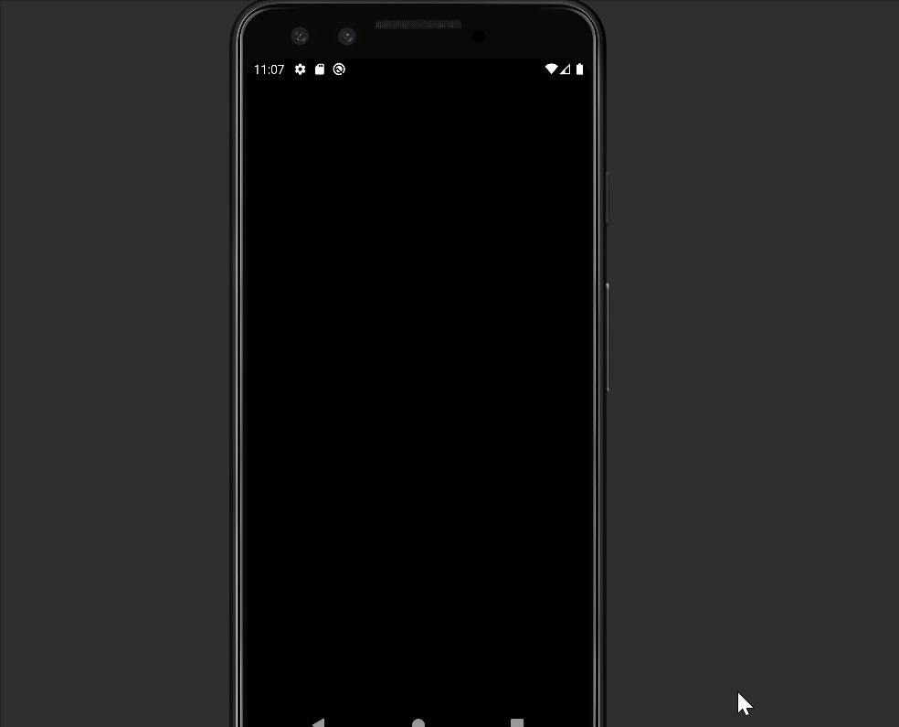

# Android Project 2 - *Wish List Project*

Submitted by: **Michael Gallo**

**WishList** is a wishlist app that helps the user keep track of what they want to buy.

Time spent: 6 hours spent in total

## Required Features

The following **required** functionality is completed:

- [x] **User can add an item to their wishlist**
- [x] **User can see their list of items based on previously inputted items**

The following **optional** features are implemented:

- [x] Wishlist app is 🎨 **customized** 🎨
- [x] User can delete an item by long pressing on the item
- [x] User can open an item's URL by clicking on the item

The following **additional** features are implemented:

* [x] List anything else that you can get done to improve the app functionality!
* [x] Hide Keyboard after button press 

## Video Walkthrough

Here's a walkthrough of implemented user stories:

<!-- Replace this with whatever GIF tool you used! -->
GIF created with [ScreenToGif] (https://www.screentogif.com/) for Windows
<!-- Recommended tools:
[Kap](https://getkap.co/) for macOS
(https://www.screentogif.com/) for Windows
[peek](https://github.com/phw/peek) for Linux. -->

## Notes

Describe any challenges encountered while building the app.

Changing the Fetcher class was tough when using most of the template code from Mail app. I also had trouble where the first item in the recycler layout is there as a blank item

## License

    Copyright [2023] [Michael Gallo]

    Licensed under the Apache License, Version 2.0 (the "License");
    you may not use this file except in compliance with the License.
    You may obtain a copy of the License at

        http://www.apache.org/licenses/LICENSE-2.0

    Unless required by applicable law or agreed to in writing, software
    distributed under the License is distributed on an "AS IS" BASIS,
    WITHOUT WARRANTIES OR CONDITIONS OF ANY KIND, either express or implied.
    See the License for the specific language governing permissions and
    limitations under the License.
